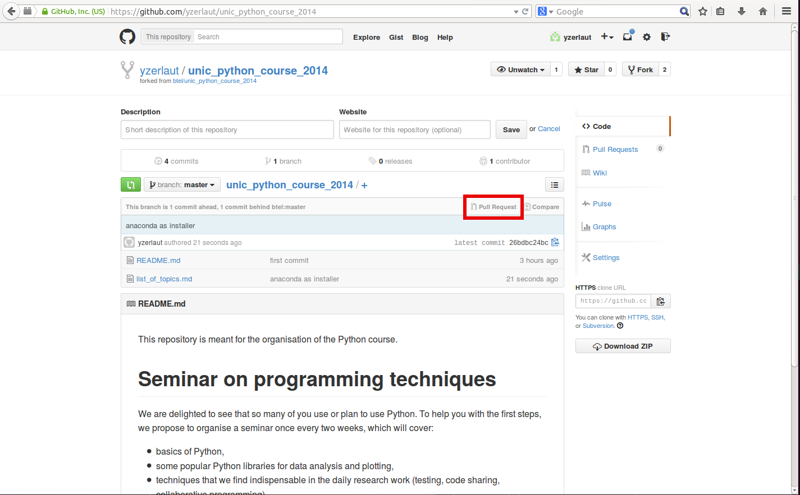

This repository is meant for the organisation of the Python course.

#Seminar on programming techniques

We are delighted to see that so many of you use or plan to use Python. To help you with the first steps, we propose to organise a seminar once every two weeks, which will cover:

* basics of Python,
* some popular Python libraries for data analysis and plotting,
* techniques that we find indispensable in the daily research work (testing, code sharing, collaborative programming).

Although the course will be Python-centered, many of the techniques we will cover can be applied in other programming languages (like Elphy or Matlab).

Please check the [list of topics](list_of_topics.md) and [contributed notebooks](http://nbviewer.ipython.org/github/btel/unic_python_course_2014/tree/master/notebooks/).

#Contributing to the repository

1) Login to github. Go to `https://github.com/btel/unic_python_course_2014` and click fork in top right corner (see docs about [forking](https://help.github.com/articles/fork-a-repo#fork-an-example-repository))

2) Clone YOUR repository:

        git clone https://github.com/btel/unic_python_course_2014.git

3) Update the files, commit and push.

4) Go back to the github page of your repository. Click the Pull request button in the top right corner of file browser (see the screenshot below). Add a comment and confirm the [pull request](https://help.github.com/articles/using-pull-requests)

If there is no conflicts, I will accept the pull request.

#Syncing your fork

From time to time you will also need to bring your repository up-to-date with the main repository (in the programming parlance called "upstream"). You do that from the command line in a few [simple steps](https://help.github.com/articles/syncing-a-fork).

1) add upstream to your remotes:

        git remote add upstream https://github.com/btel/unic_python_course_2014.git

2) fetch the changes from the upstream repository:

        git fetch upstream

3) and merge them:

        git merge upstream/master

